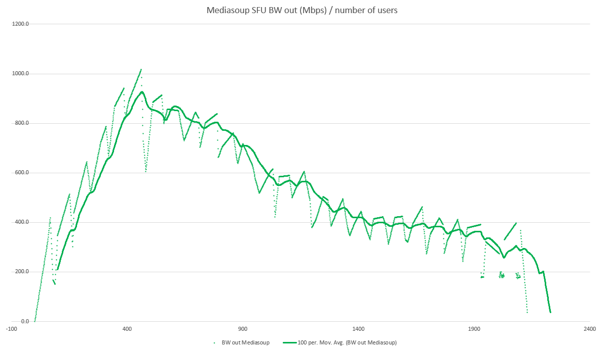
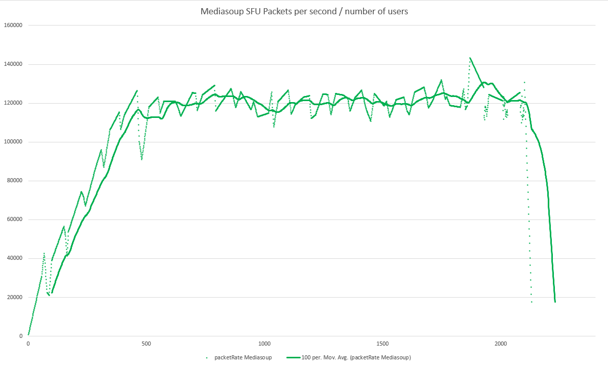
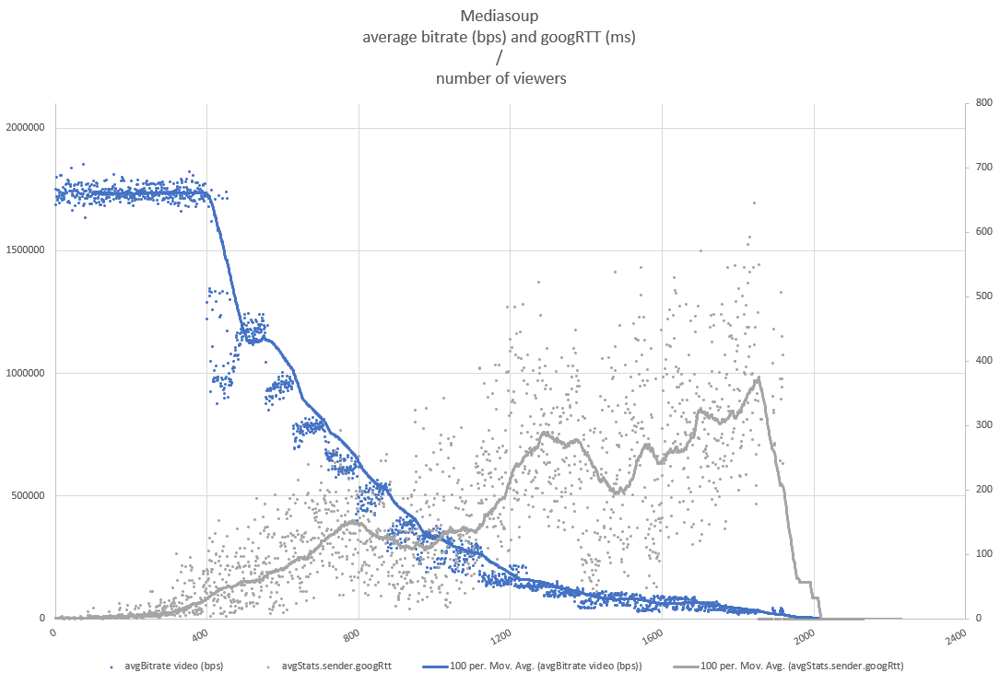
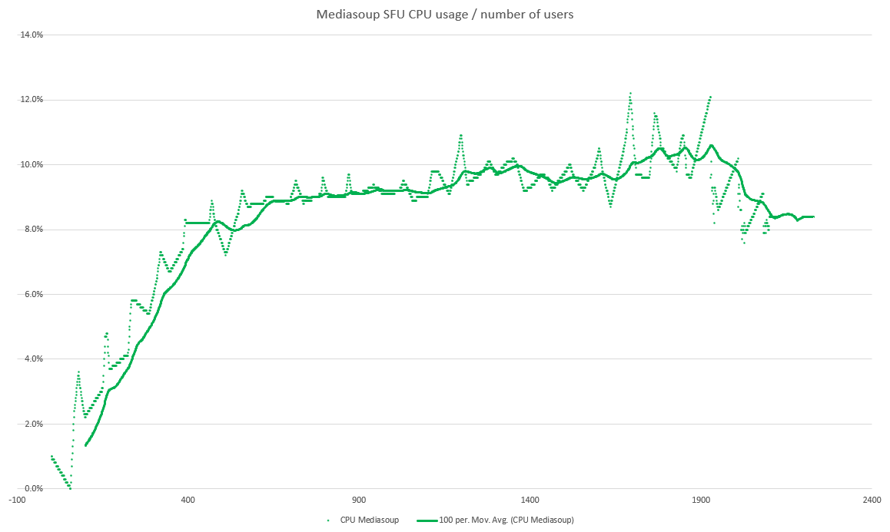

# Charts

## Broadcasting

mediasoup **v2** (a room uses a single media worker subprocess by design, so a single CPU).

Charts provided by [CoSMo](https://www.cosmosoftware.io) team.

Scenario:

* 1 peer producing audio and video tracks.
* N spy peers receiving them.

#### Bandwidth out (Mbps) / number of viewers

#### Packets per second / number of viewers

#### Average bitrate (bps) and googRTT (ms) / number of viewers

#### CPU usage / number of viewers

